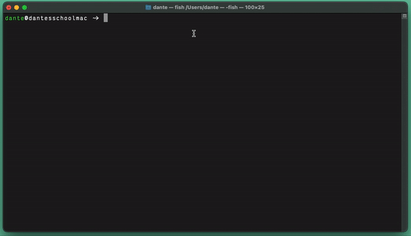

# Tramwrecked

## :busstop: About

A console application text adventure made in C#.
Inspired by four years of working as a tram driver and watching movies like Taxi Driver. Hope you like it!

## :metro: How to Play

1. Clone down this repo.
2. Open up your native Terminal app.
   Write `dotnet` followd by `space`, then drag and drop the file that ends with `.dll`
3. Hit `Return/Enter` and you're off! :railway_car: :dash:

## :checkered_flag: Creator

[Dante Mogrim](https://github.com/mogrim-91)

## :ticket: License

[MIT](https://en.wikipedia.org/wiki/MIT_License)
